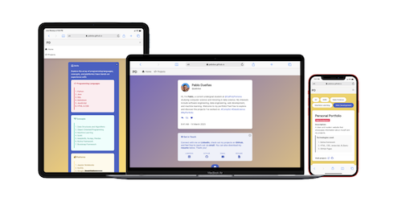

<link rel="stylesheet" href="https://cdnjs.cloudflare.com/ajax/libs/font-awesome/5.15.3/css/all.min.css">

# Personal Portfolio Website

A personal portfolio website created using GitHub Pages. Access it [here](https://pabdue.github.io/).

## Table of Contents
- [Technologies Used](#technologies-used)
- [Preview](#screenshots)
- [Usage](#usage)
- [About Me](#about-me)
- [License](#license)

## Technologies Used
- HTML
- CSS
- JavaScript
- [jQuery](https://jquery.com/)
- [Bulma Framework](https://bulma.io/)

## Preview

## Usage
- This website serves as a comprehensive portfolio, showcasing valuable information, skills, and a diverse range of projects.
- `index.html` : The <u>main</u> HTML file that represents the homepage of the portfolio website.
- `projects.html` : An HTML file that displays project cards and provides filtering functionality to showcase different projects.
- `style.css` :  A CSS file containing styles for the layout and design of both `index.html` and `projects.html`.
- `script.js` : A JavaScript file that includes functions for filtering and displaying project cards on the `projects.html` page.

## About Me
Hello, I'm Pablo! I'm an undergraduate student at California State Polytechnic University, Pomona studying Computer Science and Data Science. I have a passion for software engineering, data engineering, machine learning, and web development. Feel free to contact me for any questions:

## License
This project is licensed under the [MIT License](https://opensource.org/license/mit/). See the [LICENSE](https://github.com/pabdue/pabdue.github.io/blob/main/LICENSE.md) file for details.
